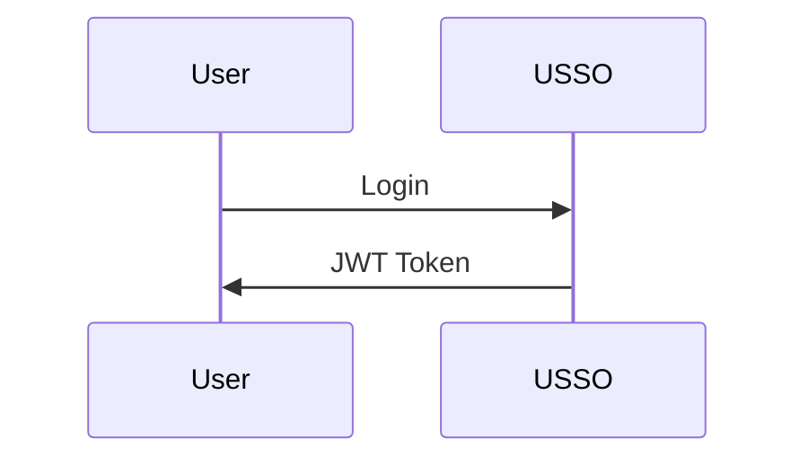

# Contributing to USSO Documentation

Thank you for your interest in improving USSO documentation! 🎉

## Quick Start

1. **Fork and clone**

   ```bash
   git clone https://github.com/YOUR_USERNAME/usso-docs.git
   cd usso-docs
   ```

2. **Install dependencies**

   ```bash
   pip install -r requirements.txt
   ```

3. **Start local server**

   ```bash
   mkdocs serve
   ```

4. **Make changes and preview at http://localhost:8000**

## Contribution Types

### 🐛 Fix Typos/Errors

Found a typo? Just fix it and submit a PR!

### 📝 Improve Explanations

Make unclear sections clearer. Add examples if helpful.

### 💡 Add Examples

Practical examples are always welcome, especially in multiple languages:
- Python
- JavaScript
- cURL

### 🌍 Translate

Help translate documentation to other languages.

### 📸 Add Visuals

Add diagrams, screenshots, or illustrations to clarify concepts.

## Writing Guidelines

### Language

- Write in **simple, clear English**
- Explain technical terms
- Target audience: developers new to USSO

### Structure

Each page should have:
1. **Title** (h1) - One per page
2. **Overview** - What is this about?
3. **Main sections** (h2)
4. **Code examples** - In multiple languages
5. **Next steps** - Links to related pages

### Code Examples

Always provide examples in at least 3 formats:

````markdown
=== "Python"

    ```python
    import requests
    response = requests.get(...)
    ```

=== "JavaScript"

    ```javascript
    const response = await fetch(...)
    ```

=== "cURL"

    ```bash
    curl -X GET ...
    ```
````

### Diagrams

Use Mermaid for diagrams:

````markdown

````

### Admonitions

Use for important notes:

```markdown
!!! tip "Pro Tip"
    This is helpful information

!!! warning "Important"
    Pay attention to this

!!! danger "Critical"
    This can break things
```

## Pull Request Process

1. **Create a feature branch**

   ```bash
   git checkout -b docs/improve-something
   ```

2. **Make your changes**

3. **Test locally**

   ```bash
   mkdocs serve
   # Check that everything looks good
   ```

4. **Commit with clear message**

   ```bash
   git commit -m "docs: improve authentication guide"
   ```

   Use prefixes:
   - `docs:` - Documentation changes
   - `fix:` - Bug fixes
   - `feat:` - New content

5. **Push and open PR**

   ```bash
   git push origin docs/improve-something
   ```

## Code of Conduct

- Be respectful and inclusive
- Provide constructive feedback
- Help others learn

## Questions?

- Open an [issue](https://github.com/ussoio/usso-docs/issues)
- Join [discussions](https://github.com/ussoio/usso/discussions)
- Email: support@usso.io

---

Thank you for making USSO better! 🙏

