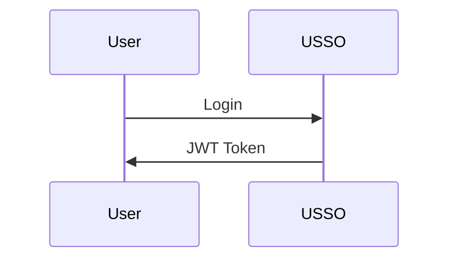

# USSO Documentation

Official documentation for [USSO](https://github.com/ussoio/usso) - A secure, multi-tenant SSO platform.

## 📖 About

This repository contains the complete documentation for USSO, built with [MkDocs](https://www.mkdocs.org/) and [Material for MkDocs](https://squidfunk.github.io/mkdocs-material/).

**Live Documentation**: [docs.usso.io](https://docs.usso.io) (coming soon)

## 🚀 Quick Start

### Prerequisites

- Python 3.10+
- pip

### Local Development

1. **Clone the repository**

   ```bash
   git clone https://github.com/ussoio/usso-docs.git
   cd usso-docs
   ```

2. **Install dependencies**

   ```bash
   pip install -r requirements.txt
   ```

3. **Start the development server**

   ```bash
   mkdocs serve
   ```

4. **Open your browser**

   Visit [http://localhost:8000](http://localhost:8000)

## 📁 Structure

```
docs/
├── index.md                    # Homepage
├── getting-started/            # Getting started guides
│   ├── overview.md
│   ├── quickstart.md
│   ├── installation.md
│   └── first-steps.md
├── concepts/                   # Core concepts
│   ├── architecture.md
│   ├── multi-tenancy.md
│   ├── auth-vs-authz.md
│   └── tokens-sessions.md
├── authentication/             # Authentication guides
│   ├── overview.md
│   ├── login-methods.md
│   ├── password.md
│   ├── magic-link.md
│   ├── otp.md
│   ├── oauth.md
│   ├── passkeys.md
│   └── qr-login.md
├── authorization/              # Authorization guides
│   ├── overview.md
│   ├── roles-permissions.md
│   ├── scopes.md
│   ├── workspace-access.md
│   └── custom-policies.md
├── user-management/            # User management
│   ├── users.md
│   ├── profiles.md
│   ├── sessions.md
│   ├── credentials.md
│   └── referrals.md
├── service-accounts/           # Service accounts
│   ├── overview.md
│   ├── creating-agents.md
│   ├── api-keys.md
│   └── best-practices.md
├── oauth-provider/             # OAuth provider
│   ├── overview.md
│   ├── setup.md
│   ├── clients.md
│   ├── flows.md
│   └── introspection.md
├── tenant/                     # Tenant management
│   ├── overview.md
│   ├── configuration.md
│   ├── domains.md
│   ├── branding.md
│   ├── messaging.md
│   └── keys.md
├── integration/                # Integration guides
│   ├── python-sdk.md
│   ├── javascript-sdk.md
│   ├── rest-api.md
│   └── webhooks.md
├── security/                   # Security guides
│   ├── best-practices.md
│   ├── captcha.md
│   ├── rate-limiting.md
│   └── token-security.md
├── deployment/                 # Deployment guides
│   ├── docker.md
│   ├── environment.md
│   ├── production.md
│   └── monitoring.md
├── api/                        # API reference
│   ├── authentication.md
│   ├── users.md
│   ├── tenants.md
│   └── oauth.md
├── roadmap.md                  # Product roadmap
├── faq.md                      # FAQ
└── contributing.md             # Contributing guide
```

## 🤝 Contributing

We welcome contributions to improve the documentation!

### How to Contribute

1. **Fork the repository**

2. **Create a feature branch**

   ```bash
   git checkout -b docs/improve-authentication-guide
   ```

3. **Make your changes**

   - Edit Markdown files in the `docs/` directory
   - Follow our [writing style guide](#writing-style-guide)
   - Test locally with `mkdocs serve`

4. **Commit your changes**

   ```bash
   git commit -m "docs: improve authentication guide"
   ```

5. **Push to your fork**

   ```bash
   git push origin docs/improve-authentication-guide
   ```

6. **Open a Pull Request**

### What to Contribute

- 🐛 **Fix typos and errors**
- 📝 **Improve explanations**
- 💡 **Add examples**
- 🌍 **Translate to other languages**
- 📸 **Add diagrams and screenshots**
- ✨ **Write new guides**

## ✍️ Writing Style Guide

### General Guidelines

- Use **clear, simple language**
- Write for **beginners** - explain technical terms
- Include **practical examples**
- Add **code samples** in multiple languages (Python, JavaScript, cURL)
- Use **diagrams** where helpful (Mermaid)

### Code Examples

Always provide examples in at least 3 formats:

````markdown
=== "Python"

    ```python
    import requests
    
    response = requests.post(...)
    ```

=== "JavaScript"

    ```javascript
    const response = await fetch(...)
    ```

=== "cURL"

    ```bash
    curl -X POST ...
    ```
````

### Markdown Conventions

- Use `#` for page title (h1) - only once per page
- Use `##` for main sections (h2)
- Use `###` for subsections (h3)
- Use code fences with language: \`\`\`python
- Use admonitions for notes/warnings:

  ```markdown
  !!! tip "Pro Tip"
      This is a helpful tip
  
  !!! warning "Important"
      Pay attention to this
  ```

### Diagrams

Use [Mermaid](https://mermaid.js.org/) for diagrams:

````markdown

````.

## 🔧 Building Documentation

### Build for Production

```bash
mkdocs build
```

This creates a `site/` directory with static HTML files.

### Deploy to GitHub Pages

```bash
mkdocs gh-deploy
```

## 📦 Dependencies

Key dependencies (see `requirements.txt`):

- **mkdocs** - Documentation generator
- **mkdocs-material** - Material theme
- **pymdown-extensions** - Markdown extensions
- **mkdocstrings** - API documentation from code

## 🔍 Search

Documentation includes full-text search powered by MkDocs search plugin.

## 🌐 Internationalization

We plan to support multiple languages. Interested in translating? [Open an issue](https://github.com/ussoio/usso-docs/issues)!

## 📄 License

This documentation is licensed under the [Creative Commons Attribution 4.0 International License](LICENSE).

The USSO software itself is licensed under the [Apache 2.0 License](https://github.com/ussoio/usso/blob/main/LICENSE).

## 🔗 Links

- **Main Repository**: [github.com/ussoio/usso](https://github.com/ussoio/usso)
- **Documentation**: [docs.usso.io](https://docs.usso.io)
- **Website**: [usso.io](https://usso.io)
- **Issues**: [github.com/ussoio/usso/issues](https://github.com/ussoio/usso/issues)
- **Discussions**: [github.com/ussoio/usso/discussions](https://github.com/ussoio/usso/discussions)

## 💬 Support

- **Documentation issues**: [Open an issue](https://github.com/ussoio/usso-docs/issues)
- **Product issues**: [Open in main repo](https://github.com/ussoio/usso/issues)
- **Questions**: [GitHub Discussions](https://github.com/ussoio/usso/discussions)
- **Email**: support@usso.io

## 🙏 Acknowledgments

Built with:

- [MkDocs](https://www.mkdocs.org/)
- [Material for MkDocs](https://squidfunk.github.io/mkdocs-material/)
- [Mermaid](https://mermaid.js.org/)

---

**Made with ❤️ by the USSO Team**
