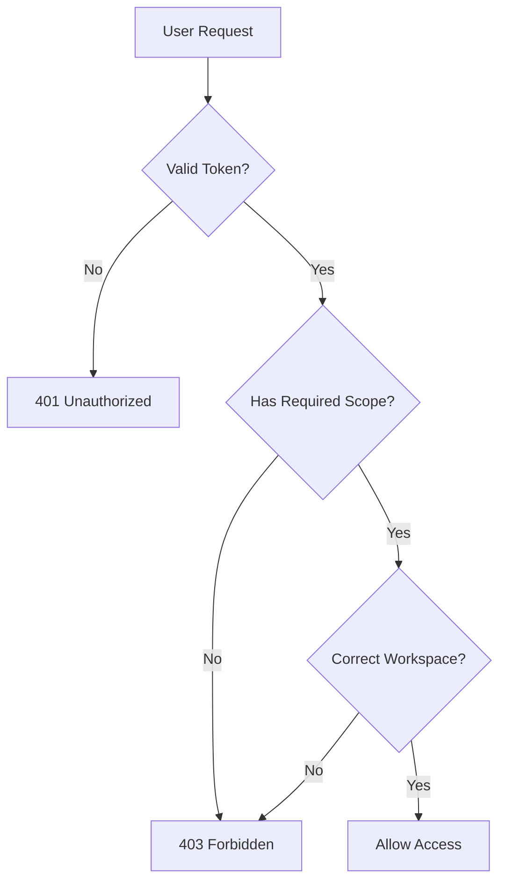

# Authorization Overview

USSO provides a powerful and flexible authorization system that combines **Role-Based Access Control (RBAC)**, **fine-grained scopes**, and **workspace isolation**. This guide explains how USSO's authorization mechanism works and how to use it effectively.

---

## What is Authorization?

While **authentication** verifies _who you are_, **authorization** determines _what you can do_.

USSO's authorization system answers questions like:

- Can this user access this workspace?
- Does this user have permission to delete resources?
- What API endpoints can this service account call?

---

## Core Authorization Concepts

USSO's authorization is built on four key concepts:

### 1. **Roles**

Roles are **bundles of permissions** that can be assigned to users. Instead of granting individual permissions, you assign roles.

**Example roles:**
- `admin` - Full access to everything
- `editor` - Can create and edit content
- `viewer` - Read-only access
- `support` - Can view user data and impersonate users

```json
{
  "id": "role_abc123",
  "name": "Editor",
  "slug": "editor",
  "scopes": ["read:users", "write:content", "read:workspace"],
  "is_active": true
}
```

### 2. **Scopes**

Scopes are **granular permissions** that define specific actions. They follow the `action:resource` pattern.

**Common scope patterns:**
- `read:users` - Can read user data
- `write:users` - Can create/update users
- `delete:users` - Can delete users
- `admin:workspace` - Full workspace admin
- `read:*` - Read access to all resources

### 3. **Workspaces**

Workspaces provide **data isolation** within a tenant. Users can belong to multiple workspaces with different roles in each.

**Use cases:**
- Multi-team SaaS: Each team has its own workspace
- Project-based apps: Each project is a workspace
- Client portals: Each client has a dedicated workspace

### 4. **Tenants**

Tenants are the **top-level isolation boundary**. Each tenant is completely isolated from others, with its own:
- Users
- Workspaces
- Roles
- Configuration

---

## How Authorization Works in USSO

### Token-Based Authorization

When a user logs in, USSO issues a JWT token containing:

```json
{
  "sub": "user:abc123",
  "tenant_id": "org_mycompany",
  "workspace_id": "ws_engineering",
  "roles": ["editor", "developer"],
  "scopes": [
    "read:users",
    "write:content",
    "read:workspace",
    "write:projects"
  ],
  "exp": 1234567890
}
```

Your application can:

1. **Validate the token** using USSO's public key
2. **Check scopes** before allowing actions
3. **Filter data** based on workspace_id

---

## Authorization Flow



---

## Creating Roles

### Via API

=== "cURL"

    ```bash
    curl -X POST http://localhost:8000/api/sso/v1/roles \
      -H "Authorization: Bearer YOUR_ADMIN_TOKEN" \
      -H "Content-Type: application/json" \
      -d '{
        "name": "Content Editor",
        "slug": "content-editor",
        "description": "Can create and edit content",
        "scopes": [
          "read:content",
          "write:content",
          "read:users"
        ],
        "is_active": true
      }'
    ```

=== "Python"

    ```python
    import requests

    response = requests.post(
        "http://localhost:8000/api/sso/v1/roles",
        headers={
            "Authorization": f"Bearer {admin_token}",
            "Content-Type": "application/json"
        },
        json={
            "name": "Content Editor",
            "slug": "content-editor",
            "description": "Can create and edit content",
            "scopes": [
                "read:content",
                "write:content",
                "read:users"
            ],
            "is_active": True
        }
    )

    role = response.json()
    print(f"Created role: {role['id']}")
    ```

=== "JavaScript"

    ```javascript
    const response = await fetch('http://localhost:8000/api/sso/v1/roles', {
        method: 'POST',
        headers: {
            'Authorization': `Bearer ${adminToken}`,
            'Content-Type': 'application/json'
        },
        body: JSON.stringify({
            name: 'Content Editor',
            slug: 'content-editor',
            description: 'Can create and edit content',
            scopes: [
                'read:content',
                'write:content',
                'read:users'
            ],
            is_active: true
        })
    });

    const role = await response.json();
    console.log('Created role:', role.id);
    ```

---

## Assigning Roles to Users

### Update User Roles

=== "cURL"

    ```bash
    curl -X PATCH http://localhost:8000/api/sso/v1/users/user:abc123 \
      -H "Authorization: Bearer YOUR_ADMIN_TOKEN" \
      -H "Content-Type: application/json" \
      -d '{
        "roles": ["content-editor", "viewer"]
      }'
    ```

=== "Python"

    ```python
    response = requests.patch(
        f"http://localhost:8000/api/sso/v1/users/{user_id}",
        headers={"Authorization": f"Bearer {admin_token}"},
        json={"roles": ["content-editor", "viewer"]}
    )
    ```

=== "JavaScript"

    ```javascript
    await fetch(`http://localhost:8000/api/sso/v1/users/${userId}`, {
        method: 'PATCH',
        headers: {
            'Authorization': `Bearer ${adminToken}`,
            'Content-Type': 'application/json'
        },
        body: JSON.stringify({
            roles: ['content-editor', 'viewer']
        })
    });
    ```

---

## Checking Permissions in Your App

### Using Python SDK

```python
from fastapi import FastAPI, Depends, HTTPException, status
from usso.integrations.fastapi import get_authenticator
from usso.config import JWTConfig
from usso.schemas import UserData

config = JWTConfig(
    jwks_url="http://localhost:8000/.well-known/jwks.json",
    issuer="http://localhost:8000",
    audience="your-app"
)

authenticator = get_authenticator(config)
app = FastAPI()

def require_scope(required_scope: str):
    """Dependency that checks for a specific scope"""
    def scope_checker(user: UserData = Depends(authenticator)):
        if required_scope not in user.scopes:
            raise HTTPException(
                status_code=status.HTTP_403_FORBIDDEN,
                detail=f"Required scope '{required_scope}' not found"
            )
        return user
    return scope_checker

@app.delete("/users/{user_id}")
def delete_user(
    user_id: str,
    current_user: UserData = Depends(require_scope("delete:users"))
):
    # Only users with 'delete:users' scope can access this
    return {"message": f"User {user_id} deleted"}

@app.get("/content")
def list_content(
    current_user: UserData = Depends(require_scope("read:content"))
):
    # Filter by workspace
    workspace_id = current_user.workspace_id
    # Query your database filtered by workspace_id
    return {"content": [], "workspace": workspace_id}
```

### Using JavaScript

```javascript
function requireScope(requiredScope) {
    return async (req, res, next) => {
        const user = req.user; // Set by authentication middleware
        
        if (!user.scopes.includes(requiredScope)) {
            return res.status(403).json({
                error: `Required scope '${requiredScope}' not found`
            });
        }
        
        next();
    };
}

// Protect routes
app.delete('/users/:id', 
    authenticator, 
    requireScope('delete:users'), 
    async (req, res) => {
        // Only users with 'delete:users' scope can access
        res.json({ message: 'User deleted' });
    }
);

app.get('/content',
    authenticator,
    requireScope('read:content'),
    async (req, res) => {
        // Filter by workspace
        const workspaceId = req.user.workspace_id;
        const content = await db.content.find({ workspace_id: workspaceId });
        res.json({ content });
    }
);
```

---

## Workspace-Based Authorization

Workspaces provide data isolation. Here's how to use them:

### 1. Create a Workspace

=== "cURL"

    ```bash
    curl -X POST http://localhost:8000/api/sso/v1/workspaces \
      -H "Authorization: Bearer YOUR_TOKEN" \
      -H "Content-Type: application/json" \
      -d '{
        "name": "Engineering Team",
        "slug": "engineering",
        "description": "Engineering team workspace"
      }'
    ```

=== "Python"

    ```python
    response = requests.post(
        "http://localhost:8000/api/sso/v1/workspaces",
        headers={"Authorization": f"Bearer {token}"},
        json={
            "name": "Engineering Team",
            "slug": "engineering",
            "description": "Engineering team workspace"
        }
    )
    workspace = response.json()
    ```

### 2. Invite Users to Workspace

=== "cURL"

    ```bash
    curl -X POST http://localhost:8000/api/sso/v1/workspaces/ws_abc123/invite \
      -H "Authorization: Bearer YOUR_TOKEN" \
      -H "Content-Type: application/json" \
      -d '{
        "user_id": "user:xyz789",
        "roles": ["editor"]
      }'
    ```

### 3. Filter Data by Workspace

In your application, always filter queries by workspace:

```python
from fastapi import Depends
from usso.schemas import UserData

@app.get("/projects")
def list_projects(user: UserData = Depends(authenticator)):
    # Get user's workspace
    workspace_id = user.workspace_id
    
    # Filter projects by workspace
    projects = db.projects.find({
        "workspace_id": workspace_id
    })
    
    return {"projects": projects}
```

---

## Common Authorization Patterns

### Pattern 1: Admin-Only Routes

```python
def require_admin(user: UserData = Depends(authenticator)):
    if "admin" not in user.roles:
        raise HTTPException(status_code=403, detail="Admin access required")
    return user

@app.post("/system/settings")
def update_settings(
    settings: dict,
    admin: UserData = Depends(require_admin)
):
    # Only admins can access
    return {"message": "Settings updated"}
```

### Pattern 2: Resource Owner Check

```python
@app.patch("/posts/{post_id}")
def update_post(
    post_id: str,
    data: dict,
    user: UserData = Depends(authenticator)
):
    post = db.posts.find_one({"id": post_id})
    
    # Check if user is owner or has admin role
    if post.owner_id != user.sub and "admin" not in user.roles:
        raise HTTPException(status_code=403, detail="Not authorized")
    
    # Update post
    return {"message": "Post updated"}
```

### Pattern 3: Scope-Based Actions

```python
@app.get("/analytics")
def get_analytics(user: UserData = Depends(authenticator)):
    analytics = {}
    
    # Different data based on scopes
    if "read:analytics:revenue" in user.scopes:
        analytics["revenue"] = get_revenue_data()
    
    if "read:analytics:users" in user.scopes:
        analytics["users"] = get_user_stats()
    
    return analytics
```

---

## Best Practices

### 1. Use Scopes for Fine-Grained Control

Don't just rely on roles. Use scopes for specific actions:

✅ **Good:**
```python
required_scopes = ["write:content", "publish:content"]
```

❌ **Bad:**
```python
required_roles = ["admin"]  # Too broad
```

### 2. Always Filter by Workspace

Never trust client-provided workspace IDs:

✅ **Good:**
```python
workspace_id = user.workspace_id  # From verified token
projects = db.find({"workspace_id": workspace_id})
```

❌ **Bad:**
```python
workspace_id = request.query_params.get("workspace_id")  # Unsafe!
```

### 3. Define Clear Scope Naming

Use consistent patterns:

- `read:resource` - Read access
- `write:resource` - Create/update access
- `delete:resource` - Delete access
- `admin:resource` - Full control

### 4. Role Hierarchies

Create logical role hierarchies:

```
admin → editor → viewer
  ↓       ↓        ↓
 all   moderate  read-only
scopes  scopes   scopes
```

### 5. Audit Important Actions

Log authorization decisions:

```python
logger.info(
    "Authorization check",
    user_id=user.sub,
    action="delete:user",
    resource_id=user_id,
    granted=has_permission
)
```

---

## Advanced Topics

- **[Custom Policies](custom-policies.md)** - Implement complex authorization logic
- **[Roles & Permissions](roles-permissions.md)** - Deep dive into role management
- **[Workspace Access](workspace-access.md)** - Advanced workspace patterns
- **[Scopes Reference](scopes.md)** - Complete scope documentation

---

## Troubleshooting

### 403 Forbidden Errors

1. Check if token contains required scopes:
```bash
curl -X POST http://localhost:8000/api/sso/v1/auth/verify-token \
  -H "Content-Type: application/json" \
  -d '{"token": "YOUR_TOKEN"}'
```

2. Verify role has the scope:
```bash
curl -X GET http://localhost:8000/api/sso/v1/roles/role_id \
  -H "Authorization: Bearer YOUR_TOKEN"
```

### Workspace Access Issues

Ensure user is member of workspace:
```bash
curl -X GET http://localhost:8000/api/sso/v1/workspaces/ws_id/members \
  -H "Authorization: Bearer YOUR_TOKEN"
```

---

[← Back to Authentication](../authentication/overview.md){ .md-button }
[Next: Roles & Permissions →](roles-permissions.md){ .md-button .md-button--primary }

