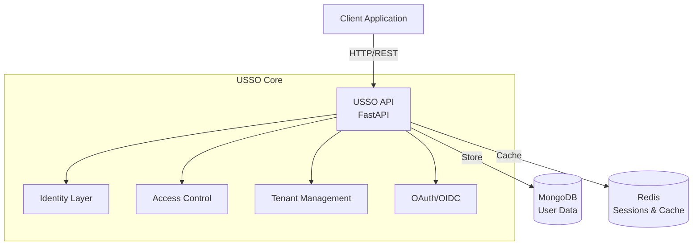
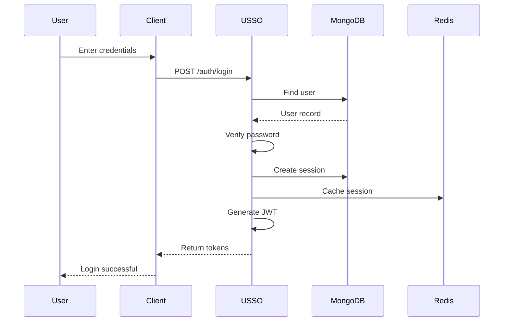
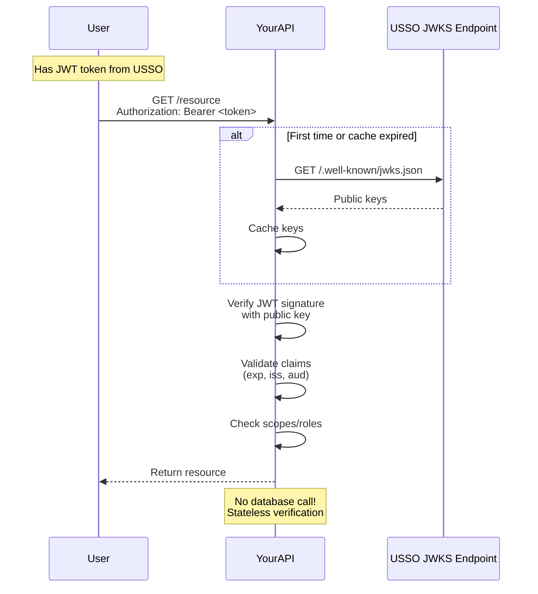
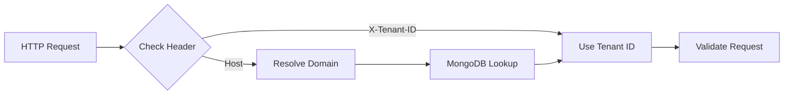
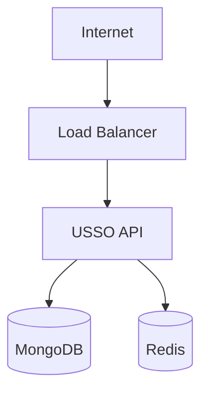
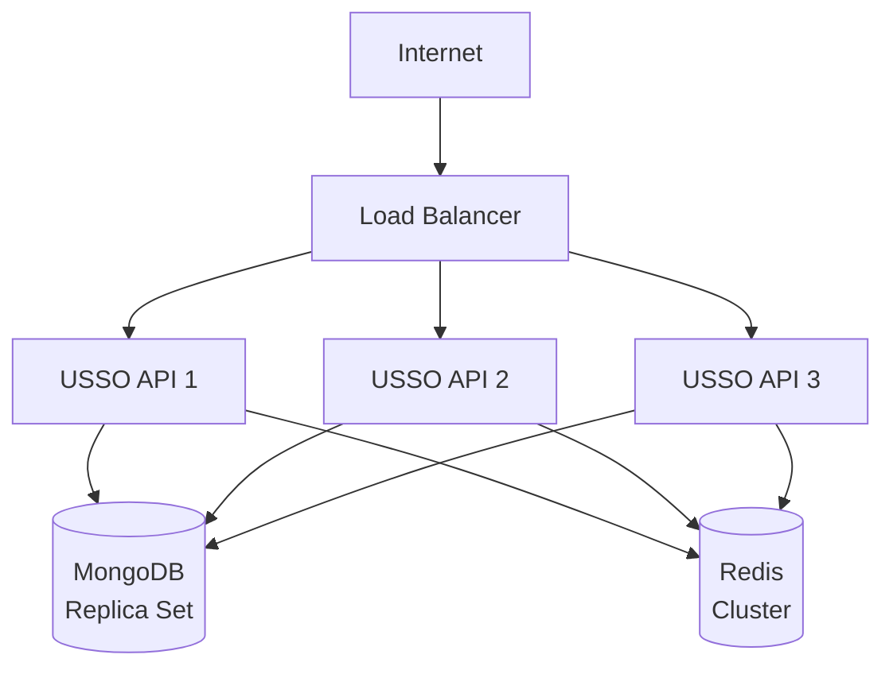

# Architecture Overview

USSO is built with a modular, multi-tenant architecture designed for scalability, security, and developer experience. This guide explains how USSO works under the hood.

---

## High-Level Architecture



---

## Core Layers

### 1. **Identity Layer** (`apps/identity/`)

Manages user identities, authentication credentials, and sessions.

**Components:**

- **User Management** - User accounts, profiles, and identifiers
- **Authentication** - Login flows, MFA, passwordless auth
- **Sessions** - Active sessions and token lifecycle
- **API Keys** - Machine credentials
- **Service Accounts** - Agent identities
- **Referrals** - Invitation and tracking system

**Key Features:**

- Multiple login methods (password, OAuth, magic link, OTP, passkeys)
- Linked accounts (one user, multiple identifiers)
- Session management with refresh tokens
- Secure credential storage

### 2. **Access Control Layer** (`apps/access_control/`)

Implements authorization through roles, scopes, and workspaces.

**Components:**

- **Roles** - Permission bundles
- **Workspaces** - Data isolation boundaries

**Key Features:**

- Role-Based Access Control (RBAC)
- Fine-grained scopes (`read:users`, `write:posts`)
- Workspace isolation
- Multi-workspace membership

### 3. **Tenant Layer** (`apps/tenant/`)

Provides multi-tenant isolation and configuration.

**Components:**

- **Tenant Management** - Organization settings
- **Domain Management** - Custom domain configuration
- **Key Management** - Cryptographic keys per tenant
- **Messaging** - Email/SMS providers
- **Branding** - Custom UI themes

**Key Features:**

- Complete tenant isolation
- Per-tenant JWT signing keys
- Configurable authentication policies
- Custom messaging providers

### 4. **Integration Layer** (`apps/tenant/integration/`)

OAuth/OIDC provider capabilities for third-party integrations.

**Components:**

- **OAuth Provider** - OAuth 2.0 server
- **OIDC Provider** - OpenID Connect
- **Client Management** - Third-party app registration

**Key Features:**

- Standard OAuth 2.0 flows
- OIDC discovery
- Token introspection
- Client credentials management

---

## Technology Stack

### Backend

| Component | Technology | Purpose |
|-----------|------------|---------|
| **Web Framework** | FastAPI | High-performance async API |
| **Database** | MongoDB + Beanie | Flexible document storage |
| **Cache & Sessions** | Redis | Fast in-memory storage |
| **JWT Library** | usso-jwt | Token generation & verification |
| **Cryptography** | cryptography (Python) | Ed25519, RSA signing |
| **Validation** | Pydantic V2 | Request/response validation |

### Infrastructure

| Component | Technology | Purpose |
|-----------|------------|---------|
| **Container** | Docker | Consistent deployment |
| **Reverse Proxy** | Traefik (optional) | SSL termination, routing |
| **Monitoring** | Sentry (optional) | Error tracking |
| **Secrets** | Vault (optional) | Secret management |

---

## Request Flow

### Authentication Request



### Protected Resource Access



---

## Data Model

### User Identity

```python
User {
    id: "user:abc123"
    tenant_id: "org_mycompany"
    identifiers: [
        {type: "email", value: "user@example.com", verified: true},
        {type: "phone", value: "+1234567890", verified: false}
    ]
    credentials: [
        {type: "password", secret_hash: "...", provider: "internal"},
        {type: "oauth", provider: "google", external_id: "..."}
    ]
    roles: ["editor", "developer"]
    workspaces: ["ws_engineering", "ws_design"]
    is_active: true
    created_at: "2025-01-01T00:00:00Z"
}
```

### Session

```python
AuthSession {
    id: "session:xyz789"
    user_id: "user:abc123"
    tenant_id: "org_mycompany"
    workspace_id: "ws_engineering"
    device_info: {
        user_agent: "...",
        ip_address: "...",
        location: "..."
    }
    expires_at: "2025-12-31T23:59:59Z"
    refresh_token: "..."
    is_active: true
}
```

### JWT Token Structure

```json
{
  "jti": "jwt_abc123",
  "token_type": "access",
  "iss": "http://localhost:8000",
  "sub": "user:abc123",
  "aud": "your-app",
  "iat": 1234567890,
  "exp": 1234571490,
  "tenant_id": "org_mycompany",
  "workspace_id": "ws_engineering",
  "roles": ["editor", "developer"],
  "scopes": ["read:users", "write:content"]
}
```

---

## Multi-Tenancy

### Isolation Strategy

USSO uses **complete tenant isolation**:

1. **Data Isolation** - All data includes `tenant_id`
2. **Key Isolation** - Each tenant has its own JWT signing keys
3. **Configuration Isolation** - Per-tenant settings
4. **Domain Isolation** - Tenants identified by domain

### Tenant Resolution



### Example: Tenant Resolution

```python
async def get_request_tenant(request: Request) -> Tenant:
    """Resolve tenant from request"""
    # Option 1: Explicit header
    tenant_id = request.headers.get("X-Tenant-ID")
    if tenant_id:
        return await Tenant.get(tenant_id)
    
    # Option 2: Domain-based
    host = request.headers.get("host", "").split(":")[0]
    tenant = await Tenant.get_from_domain(host)
    
    if not tenant:
        raise HTTPException(status_code=400, detail="Tenant not found")
    
    return tenant
```

---

## Security Architecture

### Token Security

**Access Tokens:**
- Short-lived (default: 1 hour)
- Contains user claims (roles, scopes)
- Stateless (verified via JWKS)
- EdDSA signed (Ed25519)

**Refresh Tokens:**
- Long-lived (default: 30 days)
- Stored in database
- Revocable
- Rotated on use

### Cryptographic Keys

**Per-Tenant Keys:**

```python
{
    "tenant_id": "org_mycompany",
    "keys": [
        {
            "id": "key_abc123",
            "algorithm": "EdDSA",
            "private_key": "...",  # Encrypted at rest
            "public_key": "...",
            "created_at": "2025-01-01",
            "is_active": true
        }
    ]
}
```

**Key Rotation:**
- Old tokens remain valid until expiration
- New tokens signed with new key
- Multiple active keys supported (JWKS)

### Password Security

- **Argon2id** hashing (winner of Password Hashing Competition)
- Unique salt per password
- Memory-hard algorithm (resistant to GPU attacks)
- No plaintext storage

---

## Scalability

### Horizontal Scaling

USSO is designed to scale horizontally:

1. **Stateless API** - No in-memory state
2. **Session Storage** - Redis for shared state
3. **Database** - MongoDB with sharding support
4. **Load Balancing** - Any load balancer works

### Performance Optimizations

| Optimization | Implementation | Benefit |
|--------------|----------------|---------|
| **JWKS Caching** | TTL cache | Reduce key lookups |
| **Session Caching** | Redis | Fast session validation |
| **Async I/O** | FastAPI + async/await | Handle many concurrent requests |
| **Connection Pooling** | MongoDB motor | Reuse database connections |
| **Index Optimization** | Strategic MongoDB indexes | Fast queries |

### Typical Performance

| Metric | Value | Notes |
|--------|-------|-------|
| **Token Verification** | < 10ms | With JWKS cache |
| **Login Request** | < 100ms | Including DB writes |
| **Session Validation** | < 5ms | Redis cached |
| **Concurrent Users** | 10,000+ | Per instance |
| **Requests/Second** | 1,000+ | Per instance |

---

## Module Structure

Each module follows consistent patterns:

```
module/
├── __init__.py          # Module exports
├── models.py            # Database models (Beanie)
├── schemas.py           # Pydantic request/response schemas
├── routes.py            # FastAPI route handlers
├── services.py          # Business logic
└── dependencies.py      # FastAPI dependencies (optional)
```

### Example: User Module

```python
# models.py - Database model
class User(TenantUserEntity):
    identifiers: list[UserIdentifier]
    roles: list[str]
    
    async def verify_password(self, password: str) -> bool:
        """Verify password"""
        ...

# schemas.py - API schemas
class UserResponse(BaseModel):
    id: str
    identifiers: list[IdentifierSchema]
    roles: list[str]

class UserCreateRequest(BaseModel):
    identifier: str
    password: str

# routes.py - API endpoints
router = APIRouter(prefix="/users")

@router.get("/{user_id}")
async def get_user(user_id: str) -> UserResponse:
    """Get user by ID"""
    ...

# services.py - Business logic
async def create_user(data: UserCreateRequest) -> User:
    """Create new user"""
    ...
```

---

## API Design Principles

### 1. **RESTful** Design

- Resources are nouns: `/users`, `/sessions`, `/roles`
- HTTP methods: GET (read), POST (create), PATCH (update), DELETE (delete)
- Proper status codes: 200, 201, 400, 401, 403, 404, 500

### 2. **Consistent** Responses

```json
// Success response
{
  "data": {...},
  "meta": {
    "page": 1,
    "total": 100
  }
}

// Error response
{
  "error": "Unauthorized",
  "detail": "Invalid token",
  "code": "TOKEN_INVALID"
}
```

### 3. **Pagination** Support

```python
@router.get("/users")
async def list_users(
    page: int = 1,
    limit: int = 20,
    sort: str = "-created_at"
):
    """List users with pagination"""
    ...
```

### 4. **Filtering** & Sorting

```bash
GET /users?role=admin&is_active=true&sort=-created_at
```

---

## Extensibility

### Custom Claims

Add custom claims to JWT tokens:

```python
# In token generation
def generate_token(user: User) -> str:
    claims = {
        "sub": user.id,
        "tenant_id": user.tenant_id,
        "roles": user.roles,
        "scopes": user.scopes,
        # Custom claims
        "department": user.department,
        "employee_id": user.employee_id
    }
    return sign_jwt(claims)
```

### Custom Validators

Add custom validation logic:

```python
# validator.py
async def validate_user(identifier: str) -> bool:
    """Custom validation logic"""
    # Check against external service
    return await external_kyc_service.verify(identifier)

# Use in routes
@router.post("/auth/login")
async def login(data: LoginRequest):
    if not await validate_user(data.identifier):
        raise HTTPException(status_code=400, detail="Validation failed")
    ...
```

### Webhooks

Trigger webhooks on events:

```python
# services.py
async def create_user(data: UserCreateRequest) -> User:
    user = await User.create(**data)
    
    # Trigger webhook
    await webhook_service.trigger("user.created", {
        "user_id": user.id,
        "tenant_id": user.tenant_id
    })
    
    return user
```

---

## Monitoring & Observability

### Logging

USSO uses structured logging:

```python
import logging

logger = logging.getLogger(__name__)

logger.info(
    "User login",
    user_id=user.id,
    tenant_id=tenant.id,
    ip_address=request.client.host
)
```

### Metrics

Key metrics to monitor:

- **Request Rate** - Requests per second
- **Error Rate** - 4xx and 5xx responses
- **Response Time** - p50, p95, p99
- **Token Generation** - Time to generate tokens
- **Database Queries** - Query time and count
- **Cache Hit Rate** - Redis cache efficiency

### Health Checks

```python
@app.get("/health")
async def health_check():
    return {
        "status": "healthy",
        "database": await check_mongodb(),
        "cache": await check_redis(),
        "timestamp": datetime.utcnow()
    }
```

---

## Deployment Architecture

### Single Instance



### Multi-Instance (Recommended)



---

## Next Steps

- **[Multi-Tenancy](multi-tenancy.md)** - Deep dive into tenant isolation
- **[Authentication vs Authorization](auth-vs-authz.md)** - Understanding the difference
- **[Tokens & Sessions](tokens-sessions.md)** - Token lifecycle management
- **[Workspaces & Roles](workspaces-roles.md)** - Access control concepts

---

[← Back to Home](../index.md){ .md-button }
[Next: Multi-Tenancy →](multi-tenancy.md){ .md-button .md-button--primary }

