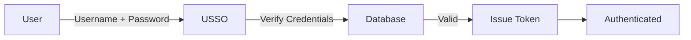
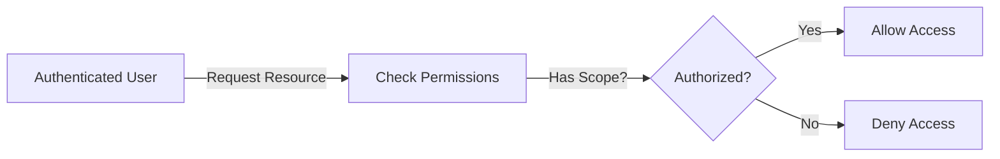
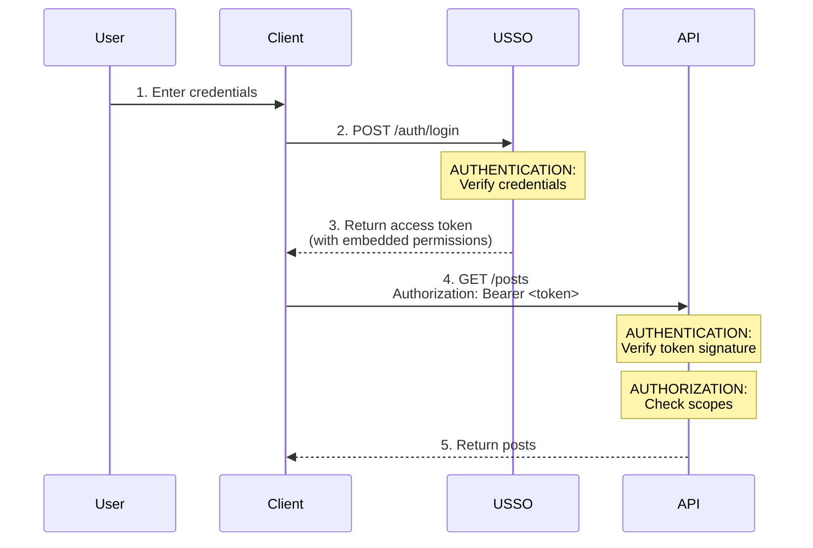

# Authentication vs Authorization

Understanding the difference between authentication and authorization is crucial for building secure applications. USSO handles both, but they serve different purposes.

---

## The Simple Explanation

| Concept | Question | Example |
|---------|----------|---------|
| **Authentication** | **Who are you?** | Proving you're Alice by entering your password |
| **Authorization** | **What can you do?** | Alice can edit posts but can't delete users |

---

## Authentication (AuthN)

**Authentication** is the process of verifying someone's identity.

### Real-World Analogy

Think of authentication like showing your ID at airport security:
- You present your passport (credential)
- Security verifies it's really you
- They confirm your identity

### In USSO



### Authentication Methods in USSO

| Method | How It Works | Use Case |
|--------|--------------|----------|
| **Password** | User enters password, USSO verifies hash | Traditional login |
| **Magic Link** | Click link in email | Passwordless |
| **OTP** | Enter code from SMS/email | Additional security |
| **OAuth** | Login with Google, GitHub, etc. | Social login |
| **Passkey** | Biometric or security key | Modern, secure |
| **QR Code** | Scan with phone | Cross-device |

### Example: Authentication Request

=== "cURL"

    ```bash
    curl -X POST http://localhost:8000/api/sso/v1/auth/login \
      -H "Content-Type: application/json" \
      -d '{
        "identifier": "alice@example.com",
        "secret": "password123"
      }'
    ```

**Response:**

```json
{
  "access_token": "eyJhbGc...",
  "token_type": "Bearer",
  "user": {
    "id": "user:alice123",
    "email": "alice@example.com"
  }
}
```

The user is now **authenticated** - we know who they are.

---

## Authorization (AuthZ)

**Authorization** is the process of determining what an authenticated user can do.

### Real-World Analogy

Think of authorization like hotel room keys:
- You're authenticated (checked in at front desk)
- Your key card (authorization) only opens certain doors
- You can't access rooms you haven't paid for

### In USSO



### Authorization Components

USSO uses three layers of authorization:

#### 1. **Roles**

Bundles of permissions:

```python
{
  "role": "editor",
  "scopes": ["read:posts", "write:posts", "read:users"]
}
```

#### 2. **Scopes**

Fine-grained permissions:

```python
# User's scopes
scopes = [
    "read:posts",    # Can read posts
    "write:posts",   # Can create/edit posts
    "read:users"     # Can view user list
]
```

#### 3. **Workspaces**

Data boundaries:

```python
{
  "user_id": "user:alice123",
  "workspace_id": "ws_engineering",
  "roles": ["editor"]
}
```

Alice can only access data in the Engineering workspace.

### Example: Authorization Check

```python
from fastapi import Depends, HTTPException

def require_scope(scope: str):
    def checker(user: UserData = Depends(authenticator)):
        if scope not in user.scopes:
            raise HTTPException(status_code=403, detail="Forbidden")
        return user
    return checker

@app.delete("/posts/{post_id}")
def delete_post(
    post_id: str,
    user: UserData = Depends(require_scope("delete:posts"))
):
    # User is authenticated (we know who they are)
    # User is authorized (they have delete:posts scope)
    return {"message": "Post deleted"}
```

---

## The Complete Flow

Here's how authentication and authorization work together:



### Step-by-Step

1. **Authentication** - User proves identity with credentials
2. **Token Issued** - USSO issues JWT with embedded permissions
3. **Authorization** - Your API checks token for required scopes
4. **Access Granted** - User can perform the action

---

## In Practice

### Example 1: Blog Application

```python
from fastapi import FastAPI, Depends
from usso.integrations.fastapi import get_authenticator
from usso.schemas import UserData

app = FastAPI()
authenticator = get_authenticator(config)

# Anyone authenticated can read posts
@app.get("/posts")
def list_posts(user: UserData = Depends(authenticator)):
    # ✅ Authenticated (we know who they are)
    return {"posts": [...]}

# Only users with write:posts can create
@app.post("/posts")
def create_post(
    post_data: dict,
    user: UserData = Depends(require_scope("write:posts"))
):
    # ✅ Authenticated (we know who they are)
    # ✅ Authorized (they have write:posts scope)
    return {"post": {...}}

# Only users with delete:posts can delete
@app.delete("/posts/{post_id}")
def delete_post(
    post_id: str,
    user: UserData = Depends(require_scope("delete:posts"))
):
    # ✅ Authenticated
    # ✅ Authorized
    return {"message": "Deleted"}
```

### Example 2: Multi-Workspace App

```python
@app.get("/projects")
def list_projects(user: UserData = Depends(authenticator)):
    # ✅ Authenticated
    # ✅ Filter by workspace (authorization)
    projects = db.projects.find({
        "workspace_id": user.workspace_id
    })
    return {"projects": projects}
```

---

## Common Patterns

### Pattern 1: Public + Protected Endpoints

```python
# Public - no authentication
@app.get("/")
def home():
    return {"message": "Welcome"}

# Protected - authentication required
@app.get("/profile")
def get_profile(user: UserData = Depends(authenticator)):
    return {"user": user}

# Admin only - authentication + authorization
@app.get("/admin/users")
def admin_users(user: UserData = Depends(require_role("admin"))):
    return {"users": [...]}
```

### Pattern 2: Resource Ownership

```python
@app.patch("/posts/{post_id}")
def update_post(
    post_id: str,
    data: dict,
    user: UserData = Depends(authenticator)
):
    post = db.posts.find_one({"id": post_id})
    
    # Authorization: Must be owner or admin
    if post.author_id != user.sub and "admin" not in user.roles:
        raise HTTPException(status_code=403, detail="Not authorized")
    
    # Update post
    return {"post": {...}}
```

### Pattern 3: Conditional Access

```python
@app.get("/analytics")
def get_analytics(user: UserData = Depends(authenticator)):
    analytics = {}
    
    # Different data based on authorization
    if "read:revenue" in user.scopes:
        analytics["revenue"] = get_revenue_data()
    
    if "read:users" in user.scopes:
        analytics["user_count"] = get_user_count()
    
    return analytics
```

---

## Security Matrix

| Scenario | Authentication | Authorization | Access |
|----------|---------------|---------------|--------|
| **Public endpoint** | ❌ Not needed | ❌ Not needed | ✅ Allow |
| **Valid token, no scope** | ✅ Valid | ❌ Missing scope | ❌ Deny |
| **Valid token, has scope** | ✅ Valid | ✅ Has scope | ✅ Allow |
| **Expired token** | ❌ Expired | N/A | ❌ Deny |
| **Invalid token** | ❌ Invalid | N/A | ❌ Deny |
| **Wrong workspace** | ✅ Valid | ❌ Wrong workspace | ❌ Deny |

---

## Common Mistakes

### ❌ Mistake 1: Confusing the Two

```python
# BAD: Only checking authentication
@app.delete("/users/{user_id}")
def delete_user(
    user_id: str,
    user: UserData = Depends(authenticator)  # Only checks authentication!
):
    # Anyone authenticated can delete any user! 🚨
    db.users.delete_one({"id": user_id})
```

```python
# GOOD: Check both authentication and authorization
@app.delete("/users/{user_id}")
def delete_user(
    user_id: str,
    user: UserData = Depends(require_scope("delete:users"))
):
    # Only users with delete:users scope can delete ✅
    db.users.delete_one({"id": user_id})
```

### ❌ Mistake 2: Client-Side Authorization

```javascript
// BAD: Trusting client to check permissions
if (user.roles.includes('admin')) {
    // Show delete button
}
```

**Problem:** Client can be manipulated! Always check on server:

```python
# GOOD: Server-side check
@app.delete("/resource/{id}")
def delete_resource(
    id: str,
    user: UserData = Depends(require_role("admin"))
):
    # Server validates authorization ✅
    ...
```

### ❌ Mistake 3: Not Validating Workspace

```python
# BAD: Not checking workspace ownership
@app.get("/projects/{project_id}")
def get_project(
    project_id: str,
    user: UserData = Depends(authenticator)
):
    # Returns ANY project, even from other workspaces! 🚨
    return db.projects.find_one({"id": project_id})
```

```python
# GOOD: Validate workspace
@app.get("/projects/{project_id}")
def get_project(
    project_id: str,
    user: UserData = Depends(authenticator)
):
    project = db.projects.find_one({
        "id": project_id,
        "workspace_id": user.workspace_id  # ✅ Check workspace
    })
    if not project:
        raise HTTPException(status_code=404)
    return project
```

---

## HTTP Status Codes

| Status | Meaning | When to Use |
|--------|---------|-------------|
| **200 OK** | Success | Request succeeded |
| **201 Created** | Resource created | POST request succeeded |
| **400 Bad Request** | Invalid input | Malformed request |
| **401 Unauthorized** | Not authenticated | Missing/invalid token |
| **403 Forbidden** | Not authorized | Valid token, insufficient permissions |
| **404 Not Found** | Resource doesn't exist | Or user can't access it |

### Example

```python
from fastapi import HTTPException, status

@app.get("/secret")
def get_secret(user: UserData = Depends(authenticator)):
    # 401 - Token missing or invalid
    # (Handled by authenticator dependency)
    
    # 403 - Token valid but no permission
    if "read:secrets" not in user.scopes:
        raise HTTPException(
            status_code=status.HTTP_403_FORBIDDEN,
            detail="Insufficient permissions"
        )
    
    # 404 - Resource not found
    secret = db.secrets.find_one({"workspace_id": user.workspace_id})
    if not secret:
        raise HTTPException(
            status_code=status.HTTP_404_NOT_FOUND,
            detail="Secret not found"
        )
    
    # 200 - Success
    return secret
```

---

## JWT Claims

USSO embeds authorization information in JWT tokens:

```json
{
  "sub": "user:alice123",
  "tenant_id": "org_mycompany",
  "workspace_id": "ws_engineering",
  "roles": ["editor", "developer"],
  "scopes": [
    "read:posts",
    "write:posts",
    "read:users"
  ],
  "exp": 1234567890
}
```

Your application can read these claims to make authorization decisions **without calling USSO** for every request.

---

## Best Practices

### 1. ✅ Always Validate Both

```python
# Check authentication (valid token)
user = authenticator(request)

# Check authorization (has permission)
if "required_scope" not in user.scopes:
    raise HTTPException(status_code=403)
```

### 2. ✅ Use Least Privilege

Only grant minimum required permissions:

```python
# Good: Specific scopes
scopes = ["read:own_posts", "write:own_posts"]

# Bad: Too broad
scopes = ["admin:*"]
```

### 3. ✅ Check Workspace Ownership

Always filter by workspace:

```python
resources = db.resources.find({
    "workspace_id": user.workspace_id  # ✅ Always include
})
```

### 4. ✅ Log Authorization Failures

Track who tried to access what:

```python
if required_scope not in user.scopes:
    logger.warning(
        "Authorization failed",
        user_id=user.sub,
        required_scope=required_scope,
        user_scopes=user.scopes
    )
    raise HTTPException(status_code=403)
```

### 5. ✅ Fail Securely

Default to denying access:

```python
def has_permission(user: UserData, resource: Resource) -> bool:
    # Default to False
    if resource.owner_id == user.sub:
        return True
    if "admin" in user.roles:
        return True
    return False  # Default deny
```

---

## Summary

| Concept | Purpose | How USSO Helps |
|---------|---------|----------------|
| **Authentication** | Verify identity | Multiple login methods, JWT tokens |
| **Authorization** | Control access | Roles, scopes, workspaces |
| **Both Together** | Secure apps | Complete auth system |

**Remember:**
- **Authentication** = "Who are you?"
- **Authorization** = "What can you do?"
- **Always check both** for protected resources

---

## Next Steps

- **[Tokens & Sessions](tokens-sessions.md)** - How tokens work
- **[Workspaces & Roles](workspaces-roles.md)** - Organizing permissions
- **[Authorization Guide](../authorization/overview.md)** - Detailed authorization docs

---

[← Back to Multi-Tenancy](multi-tenancy.md){ .md-button }
[Next: Tokens & Sessions →](tokens-sessions.md){ .md-button .md-button--primary }

