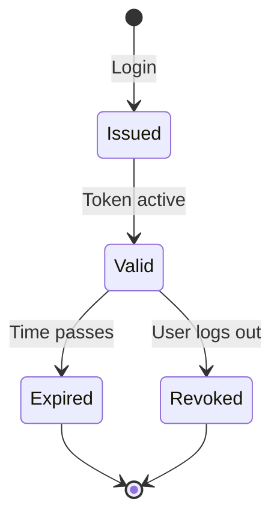
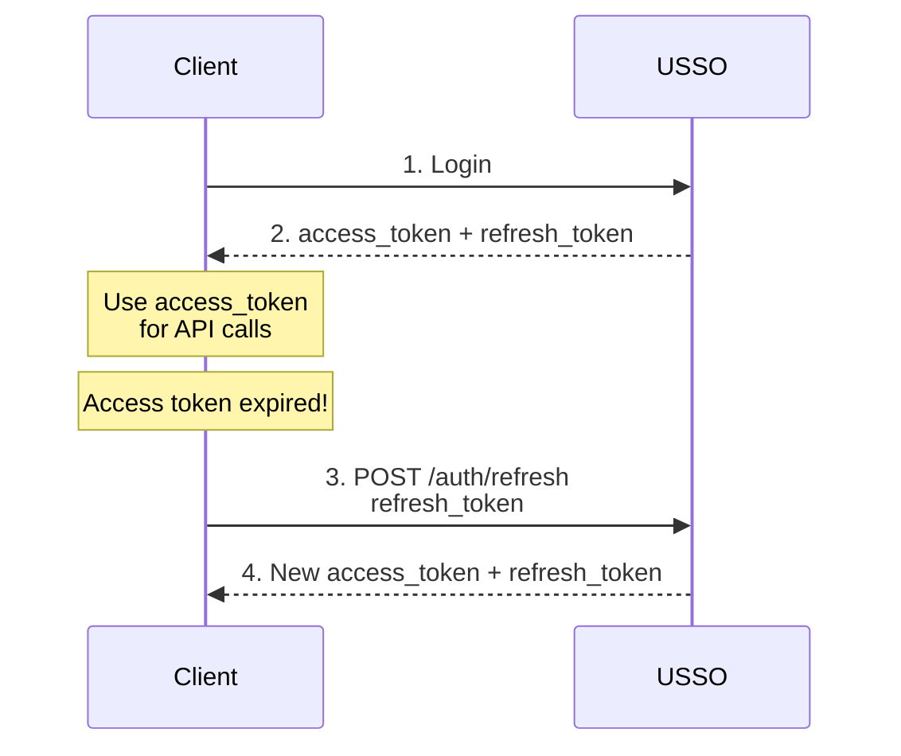

# Tokens & Sessions

USSO uses JWT tokens and sessions to manage user authentication state. Understanding how they work is essential for building secure applications.

---

## Overview

USSO provides two types of tokens:

| Token Type | Lifespan | Storage | Purpose |
|------------|----------|---------|---------|
| **Access Token** | Short (1 hour) | Memory/localStorage | API authentication |
| **Refresh Token** | Long (30 days) | Database + Cookie | Renew access tokens |

---

## Access Tokens

### What is an Access Token?

A **JWT (JSON Web Token)** that proves authentication and contains authorization claims.

**Structure:**

```
eyJhbGciOiJFZERTQSIsInR5cCI6IkpXVCJ9.eyJzdWIiOiJ1c2VyOmFiYzEyMyIsInRlbmFudF9pZCI6Im9yZ19jb21wYW55Iiwicm9sZXMiOlsiZWRpdG9yIl0sInNjb3BlcyI6WyJyZWFkOnBvc3RzIiwid3JpdGU6cG9zdHMiXSwiZXhwIjoxNzMwMDAwMDAwfQ.signature
```

Decoded:

```json
{
  "alg": "EdDSA",
  "typ": "JWT"
}
{
  "jti": "jwt_abc123",
  "sub": "user:abc123",
  "iss": "http://localhost:8000",
  "aud": "your-app",
  "iat": 1729996400,
  "exp": 1730000000,
  "tenant_id": "org_company",
  "workspace_id": "ws_engineering",
  "roles": ["editor"],
  "scopes": ["read:posts", "write:posts"]
}
```

### Using Access Tokens

=== "cURL"

    ```bash
    curl -X GET http://localhost:8000/api/sso/v1/me \
      -H "Authorization: Bearer YOUR_ACCESS_TOKEN"
    ```

=== "Python"

    ```python
    import requests

    headers = {"Authorization": f"Bearer {access_token}"}
    response = requests.get("http://localhost:8000/api/sso/v1/me", headers=headers)
    ```

=== "JavaScript"

    ```javascript
    const response = await fetch('http://localhost:8000/api/sso/v1/me', {
        headers: {
            'Authorization': `Bearer ${accessToken}`
        }
    });
    ```

### Access Token Lifecycle



---

## Refresh Tokens

### What is a Refresh Token?

A long-lived token used to obtain new access tokens without re-authentication.

**Why?**
- Access tokens are short-lived (security)
- Refresh tokens avoid repeated logins (UX)

### Refresh Flow



### Refreshing Tokens

=== "cURL"

    ```bash
    curl -X POST http://localhost:8000/api/sso/v1/auth/refresh \
      -H "Content-Type: application/json" \
      -d '{"refresh_token": "YOUR_REFRESH_TOKEN"}'
    ```

=== "Python"

    ```python
    response = requests.post(
        "http://localhost:8000/api/sso/v1/auth/refresh",
        json={"refresh_token": refresh_token}
    )
    new_tokens = response.json()
    ```

=== "JavaScript"

    ```javascript
    const response = await fetch('http://localhost:8000/api/sso/v1/auth/refresh', {
        method: 'POST',
        headers: {'Content-Type': 'application/json'},
        body: JSON.stringify({refresh_token: refreshToken})
    });
    const newTokens = await response.json();
    ```

---

## Sessions

### What is a Session?

A database record tracking user authentication state.

```python
{
  "id": "session:xyz789",
  "user_id": "user:abc123",
  "tenant_id": "org_company",
  "workspace_id": "ws_engineering",
  "refresh_token": "...",
  "device_info": {
    "user_agent": "Mozilla/5.0...",
    "ip_address": "192.168.1.1"
  },
  "created_at": "2025-10-04T10:00:00Z",
  "expires_at": "2025-11-03T10:00:00Z",
  "is_active": true
}
```

### Session Management

List active sessions:

```bash
curl -X GET http://localhost:8000/api/sso/v1/sessions \
  -H "Authorization: Bearer YOUR_TOKEN"
```

Revoke a session:

```bash
curl -X DELETE http://localhost:8000/api/sso/v1/sessions/session:xyz789 \
  -H "Authorization: Bearer YOUR_TOKEN"
```

---

## Token Security

### 1. **Storage**

| Location | Access Tokens | Refresh Tokens |
|----------|---------------|----------------|
| **Memory** | ✅ Best | ❌ Lost on reload |
| **localStorage** | ⚠️ XSS risk | ❌ Never |
| **sessionStorage** | ⚠️ XSS risk | ❌ Never |
| **HTTP-only Cookie** | ✅ Good | ✅ Best |

**Recommendation:**
- **Access tokens**: Memory or HTTP-only cookie
- **Refresh tokens**: HTTP-only cookie only

### 2. **Token Rotation**

USSO rotates refresh tokens on use:

```
Old refresh_token → New access_token + New refresh_token
```

**Benefits:**
- Limits attack window
- Detects token theft
- Prevents replay attacks

### 3. **Token Revocation**

Immediately invalidate tokens:

```bash
# Logout (revokes refresh token)
curl -X POST http://localhost:8000/api/sso/v1/auth/logout \
  -H "Authorization: Bearer YOUR_TOKEN"
```

---

## Implementation Examples

### Web Application (Cookie-Based)

```javascript
// Login
async function login(email, password) {
    const response = await fetch('/api/sso/v1/auth/login', {
        method: 'POST',
        headers: {'Content-Type': 'application/json'},
        credentials: 'include',  // ← Important!
        body: JSON.stringify({identifier: email, secret: password})
    });
    
    const data = await response.json();
    // Tokens stored in HTTP-only cookies automatically
    return data;
}

// API call (cookies sent automatically)
async function fetchData() {
    const response = await fetch('/api/data', {
        credentials: 'include'  // ← Include cookies
    });
    return await response.json();
}

// Refresh (automatic with cookies)
async function refreshToken() {
    const response = await fetch('/api/sso/v1/auth/refresh', {
        method: 'POST',
        credentials: 'include'  // ← Send refresh cookie
    });
    return await response.json();
}
```

### Mobile/SPA (Token-Based)

```javascript
// Store tokens in memory
let accessToken = null;
let refreshToken = null;

// Login
async function login(email, password) {
    const response = await fetch('/api/sso/v1/auth/login', {
        method: 'POST',
        headers: {'Content-Type': 'application/json'},
        body: JSON.stringify({identifier: email, secret: password})
    });
    
    const data = await response.json();
    accessToken = data.access_token;
    refreshToken = data.refresh_token;
    
    // Optionally store refresh token securely
    await SecureStore.setItemAsync('refresh_token', refreshToken);
}

// API call with token
async function fetchData() {
    try {
        const response = await fetch('/api/data', {
            headers: {'Authorization': `Bearer ${accessToken}`}
        });
        
        if (response.status === 401) {
            // Token expired, refresh
            await refreshAccessToken();
            return fetchData();  // Retry
        }
        
        return await response.json();
    } catch (error) {
        console.error('API error:', error);
    }
}

// Refresh token
async function refreshAccessToken() {
    const response = await fetch('/api/sso/v1/auth/refresh', {
        method: 'POST',
        headers: {'Content-Type': 'application/json'},
        body: JSON.stringify({refresh_token: refreshToken})
    });
    
    const data = await response.json();
    accessToken = data.access_token;
    refreshToken = data.refresh_token;
}
```

### Automatic Refresh with Interceptor

```javascript
// Axios interceptor
axios.interceptors.response.use(
    response => response,
    async error => {
        const originalRequest = error.config;
        
        // If 401 and haven't retried yet
        if (error.response?.status === 401 && !originalRequest._retry) {
            originalRequest._retry = true;
            
            try {
                // Refresh token
                const response = await axios.post('/api/sso/v1/auth/refresh', {
                    refresh_token: refreshToken
                });
                
                // Update token
                accessToken = response.data.access_token;
                
                // Retry original request
                originalRequest.headers['Authorization'] = `Bearer ${accessToken}`;
                return axios(originalRequest);
            } catch (refreshError) {
                // Refresh failed, redirect to login
                window.location.href = '/login';
                return Promise.reject(refreshError);
            }
        }
        
        return Promise.reject(error);
    }
);
```

---

## Token Verification

### Server-Side Verification

```python
from usso import USSOAuth
from usso.config import JWTConfig

config = JWTConfig(
    jwks_url="http://localhost:8000/.well-known/jwks.json",
    issuer="http://localhost:8000",
    audience="your-app"
)

auth = USSOAuth(config)

# Verify token
try:
    user_data = auth.verify_token(access_token)
    print(f"User: {user_data.sub}")
    print(f"Roles: {user_data.roles}")
except Exception as e:
    print(f"Invalid token: {e}")
```

### JWKS (JSON Web Key Set)

USSO publishes public keys at:

```
http://localhost:8000/.well-known/jwks.json
```

Response:

```json
{
  "keys": [
    {
      "kty": "OKP",
      "use": "sig",
      "kid": "key_abc123",
      "alg": "EdDSA",
      "crv": "Ed25519",
      "x": "..."
    }
  ]
}
```

Your application caches these keys to verify tokens.

---

## Best Practices

### 1. ✅ Short Access Token Lifetime

```python
ACCESS_TOKEN_EXPIRE = 3600  # 1 hour
```

### 2. ✅ Rotate Refresh Tokens

```python
# Always issue new refresh token
new_refresh_token = generate_refresh_token()
old_session.refresh_token = new_refresh_token
```

### 3. ✅ Store Refresh Tokens Securely

```javascript
// ❌ Bad
localStorage.setItem('refresh_token', token);

// ✅ Good
// Use HTTP-only cookies (server-side)
```

### 4. ✅ Validate Token Claims

```python
# Check expiration
if token.exp < time.time():
    raise TokenExpired()

# Check audience
if token.aud != expected_audience:
    raise InvalidAudience()

# Check issuer
if token.iss != expected_issuer:
    raise InvalidIssuer()
```

### 5. ✅ Handle Token Refresh Gracefully

```javascript
// Queue requests during refresh
let isRefreshing = false;
let refreshSubscribers = [];

async function refreshToken() {
    if (isRefreshing) {
        // Wait for ongoing refresh
        return new Promise(resolve => {
            refreshSubscribers.push(resolve);
        });
    }
    
    isRefreshing = true;
    try {
        const newToken = await doRefresh();
        refreshSubscribers.forEach(cb => cb(newToken));
        return newToken;
    } finally {
        isRefreshing = false;
        refreshSubscribers = [];
    }
}
```

---

## Troubleshooting

### Token Expired

```json
{
  "error": "Token expired",
  "detail": "The token has expired"
}
```

**Solution:** Refresh the token.

### Invalid Signature

```json
{
  "error": "Invalid token",
  "detail": "Signature verification failed"
}
```

**Solutions:**
- Ensure JWKS URL is correct
- Check token wasn't modified
- Verify using correct public key

### Audience Mismatch

```json
{
  "error": "Invalid audience"
}
```

**Solution:** Token issued for different app. Check `aud` claim.

---

## Next Steps

- **[Workspaces & Roles](workspaces-roles.md)** - Authorization concepts
- **[Authentication Guide](../authentication/overview.md)** - Login methods
- **[Security Best Practices](../security/best-practices.md)** - Secure your app

---

[← Back to Auth vs Authz](auth-vs-authz.md){ .md-button }
[Next: Workspaces & Roles →](workspaces-roles.md){ .md-button .md-button--primary }

