# Getting Started Overview

Welcome to USSO! This guide will help you understand how USSO works and get started quickly.

---

## What is USSO?

USSO (Universal Single Sign-On) is an identity platform that provides:

- **Authentication** - Verify who users are
- **Authorization** - Control what users can do
- **Multi-tenancy** - Serve multiple organizations
- **Token management** - Secure JWT-based access

---

## How USSO Works

### The Big Picture


### Key Concept: Stateless Verification

USSO's power comes from **stateless JWT verification**:

1. **User logs in** to USSO (once)
2. **USSO issues JWT** signed with its private key
3. **User sends JWT** to your apps
4. **Your apps verify JWT** using USSO's public key
5. **No database calls needed** - everything is in the token!

This means:
- ⚡ **Lightning fast** - verification takes < 1ms
- 📈 **Highly scalable** - USSO isn't a bottleneck
- 🔌 **Works offline** - apps verify independently
- 🌍 **True SSO** - one token, many apps

---

## JWT Token Explained

A JWT token contains three parts:

```
eyJhbGc...  .  eyJzdWI...  .  signature
   ↓              ↓              ↓
 Header       Payload        Signature
```

### Header

```json
{
  "alg": "EdDSA",  // Signing algorithm
  "typ": "JWT"     // Token type
}
```

### Payload (Claims)

```json
{
  "sub": "user:alice123",           // User ID
  "tenant_id": "org_mycompany",     // Tenant
  "workspace_id": "ws_engineering", // Workspace
  "roles": ["editor", "developer"], // Roles
  "scopes": [                        // Permissions
    "read:users",
    "write:posts"
  ],
  "exp": 1730000000                 // Expiration
}
```

### Signature

```
HMACSHA256(
  base64UrlEncode(header) + "." +
  base64UrlEncode(payload),
  USSO_PRIVATE_KEY
) 
```

Your apps verify the signature using USSO's **public key** from:
```
http://localhost:8000/.well-known/jwks.json
```

---

## Public Key Infrastructure (PKI)

USSO uses **asymmetric cryptography**:

```mermaid
graph LR
    PrivateKey[🔑 USSO Private Key<br/>Signs tokens]
    PublicKey[🔓 USSO Public Key<br/>Verifies tokens]
    Token[JWT Token]
    Apps[Your Apps]
    
    PrivateKey -->|Sign| Token
    Token -->|Send| Apps
    PublicKey -->|Verify| Apps
    
    style PrivateKey fill:#FF6B6B
    style PublicKey fill:#4ECDC4
```



**Private Key** (kept secret by USSO):
- Used to **sign** JWT tokens
- Never shared with anyone
- Unique per tenant

**Public Key** (shared with everyone):
- Used to **verify** JWT tokens
- Published at JWKS endpoint
- Safe to share publicly

---

## JWKS (JSON Web Key Set)

USSO publishes its public keys at:

```
GET http://localhost:8000/.well-known/jwks.json
```

Response:

```json
{
  "keys": [
    {
      "kty": "OKP",
      "use": "sig",
      "kid": "key_abc123",
      "alg": "EdDSA",
      "crv": "Ed25519",
      "x": "base64_public_key_here"
    }
  ]
}
```

Your apps:
1. **Fetch** these keys once
2. **Cache** them (1 hour TTL)
3. **Use** them to verify tokens
4. **Refresh** when cache expires

---

## The Authentication Flow

### Step 1: User Logs In

```bash
curl -X POST http://localhost:8000/api/sso/v1/auth/login \
  -H "Content-Type: application/json" \
  -d '{
    "identifier": "alice@example.com",
    "secret": "password123"
  }'
```

Response:

```json
{
  "access_token": "eyJhbGc...",
  "refresh_token": "eyJhbGc...",
  "token_type": "Bearer",
  "expires_in": 3600
}
```

### Step 2: User Calls Your App

```bash
curl -X GET https://your-app.com/api/data \
  -H "Authorization: Bearer eyJhbGc..."
```

### Step 3: Your App Verifies Token

```python
from usso import USSOAuth
from usso.config import JWTConfig

config = JWTConfig(
    jwks_url="http://localhost:8000/.well-known/jwks.json",
    issuer="http://localhost:8000",
    audience="your-app"
)

auth = USSOAuth(config)

# Verify token (happens locally, no network call!)
user = auth.verify_token(access_token)

# user.sub = "user:alice123"
# user.roles = ["editor"]
# user.scopes = ["read:users", "write:posts"]
```

### Step 4: Your App Checks Permissions

```python
# Check if user has required scope
if "write:posts" in user.scopes:
    # Allow action
    create_post(...)
else:
    # Deny
    raise HTTPException(status_code=403)
```

---

## Multi-Tenant Architecture

USSO supports **complete tenant isolation**:

```
USSO Instance
├── Tenant: Company A (org_company_a)
│   ├── Users: 1,000
│   ├── JWT Keys: Ed25519 key pair
│   └── Workspaces: Engineering, Marketing
│
├── Tenant: Company B (org_company_b)
│   ├── Users: 500
│   ├── JWT Keys: Ed25519 key pair
│   └── Workspaces: Sales, Support
│
└── Tenant: Company C (org_company_c)
    ├── Users: 2,000
    ├── JWT Keys: Ed25519 key pair
    └── Workspaces: Dev, QA, Production
```

Each tenant:
- Has **separate users and data**
- Uses **different JWT signing keys**
- Has **independent configuration**
- Can use **custom domains**

---

## What's Next?

Now that you understand how USSO works, let's get it running:

### Quick Path (10 minutes)

1. [Quick Start](quickstart.md) - Get USSO running with Docker
2. [First Steps](first-steps.md) - Create your first user and token
3. [Python SDK](../integration/python-sdk.md) - Integrate with your app

### Learning Path

1. [Architecture](../concepts/architecture.md) - Deep dive into USSO's design
2. [Multi-Tenancy](../concepts/multi-tenancy.md) - Understand tenant isolation
3. [Auth vs Authz](../concepts/auth-vs-authz.md) - Learn the difference
4. [Tokens & Sessions](../concepts/tokens-sessions.md) - Master token management

### Integration Path

1. [Python SDK](../integration/python-sdk.md) - FastAPI/Django integration
2. [JavaScript SDK](../integration/javascript-sdk.md) - Frontend integration
3. [REST API](../integration/rest-api.md) - Direct API usage

---

## Common Scenarios

### Scenario 1: SaaS Application

You're building a SaaS product with multiple customers:

- Each customer = one **tenant**
- Each tenant has isolated users and data
- Users get tokens with `tenant_id`
- Your app filters data by `tenant_id`

[Learn more about multi-tenancy →](../concepts/multi-tenancy.md)

### Scenario 2: Microservices

You have multiple services (web, mobile, API):

- Users login via web app
- USSO issues JWT token
- Same token works for all services
- Services verify independently

[Learn more about service accounts →](../service-accounts/overview.md)

### Scenario 3: Partner Integrations

You want partners to access your API:

- Register partner as OAuth client
- Partner gets authorization code
- Partner exchanges for access token
- Partner calls your API with token

[Learn more about OAuth provider →](../oauth-provider/overview.md)

---

## Key Takeaways

✅ **USSO issues JWT tokens** signed with private keys  
✅ **Your apps verify tokens** using public keys (JWKS)  
✅ **No database calls** needed for verification  
✅ **Stateless and scalable** - apps work independently  
✅ **Multi-tenant by design** - complete isolation  
✅ **One token, many apps** - true Single Sign-On

---

[Next: Quick Start →](quickstart.md){ .md-button .md-button--primary }
[View Architecture →](../concepts/architecture.md){ .md-button }

