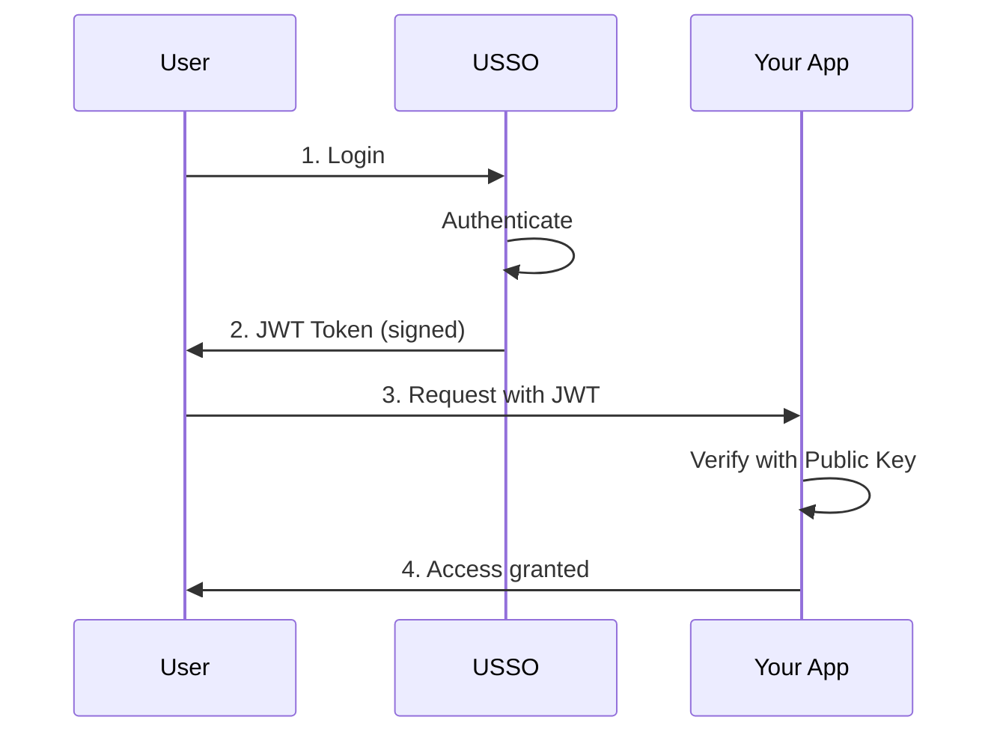

# Welcome to USSO

**Secure authentication and authorization for your application, without the complexity.**

USSO (Universal Single Sign-On) is a modern, multi-tenant identity platform that handles authentication, authorization, and user management so you can focus on building your product.

---

## 🚀 Why USSO?

Building authentication from scratch is time-consuming, risky and chalenging. USSO provides:

* ✅ **Flexible authentication** — Password, Magic Link, OTP, OAuth, Passkeys, and QR-based login.
* ✅ **Granular authorization** — Role-based access control (RBAC) with workspace isolation, plus attribute-based access control (ABAC).
* ✅ **Secure token management** — Public key–based JWTs with access & refresh tokens, custom claims, and support for both cookies and headers.
* ✅ **API keys** — First-class, scoped API keys for programmatic access.
* ✅ **Service accounts** — JWT-based authentication for agents and non-human clients.
* ✅ **OAuth integrations** — Delegated authorization for third-party services.
* ✅ **Developer SDKs** — Official Python and JavaScript SDKs.
* ✅ **Multiple workspaces** — Independent permission models inside each tenant.
* ✅ **Multi-tenant isolation** — Built-in separation for SaaS applications.
* ✅ **Flexible deployment** — Self-hosted or fully managed, deployable with Docker in minutes.

---
## 🎯 Perfect for Startups

USSO is designed for early-stage companies that need enterprise-grade authentication without the overhead:

- **Quick to integrate** — Get started in under 30 minutes  
- **Scales with you** — From MVP to production  
- **Open source** — No vendor lock-in  
- **Cost-effective** — Self-host with Docker or use our managed service  

USSO has you covered — no more stitching together ad-hoc user management solutions (OAuth, API keys, etc.) as your product grows.

---

## 🏗️ How It Works



1. **User authenticates** with USSO using their preferred method
2. **USSO issues JWT token** signed with private key, containing user identity and permissions
3. **User sends JWT** to your application(s)
4. **Your apps verify JWT** using USSO's public key (via JWKS) - no need to call USSO!
5. **Same token works** across all your applications - true Single Sign-On

!!! note "📌 Considerations"

    🚀 **Performance** — Apps verify tokens locally (<1ms), with no network calls to USSO.  

    🔒 **Security** — Tokens are cryptographically signed; apps trust the signature, not the bearer.  

    📱 **Scalability** — USSO never becomes a bottleneck; applications remain independent.  

    🌐 **Universality** — One token works across all services, enabling a true SSO experience.  

---

## 📚 Quick Links

🚀 [**Getting Started**](getting-started/quickstart.md)
Install USSO and create your first user in 5 minutes

📖 [**Core Concepts**](concepts/architecture.md)
Understand multi-tenancy, tokens, and authorization

💻 [**Integration Guide**](integration/python-sdk.md)
Connect your app with Python SDK

📚 [**API Reference**](api/authentication.md)
Complete REST API documentation

---

## 🔒 Security First

USSO is built with security as a top priority:

- **Modern cryptography** - EdDSA (Ed25519) by default, RSA and ECDSA are also supported
- **Token security** - Short-lived access tokens with refresh rotation
- **Rate limiting** - Protection against brute force attacks
- **Audit logs** - Track all authentication events
- **Open source** - Transparent and auditable code

[Learn about security →](security/best-practices.md)

## 🔐 Authentication Methods

USSO supports multiple authentication methods out of the box:

| Method | Use Case |
|--------|----------|
| **Password** | Traditional email/password login |
| **Magic Link** | Passwordless email authentication |
| **OTP** | SMS or email one-time codes |
| **OAuth/OIDC** | Login with Google, GitHub, etc. |
| **Passkeys** | WebAuthn biometric authentication |
| **QR Code** | Cross-device login (like WhatsApp Web) |

[Learn more about authentication methods →](authentication/login-methods.md)

---

## 🛡️ Authorization That Scales

USSO's authorization system grows with your needs:

- **Roles** - Bundle permissions into reusable roles
- **Scopes** - Fine-grained access control
- **Workspaces** - Isolate data by team or organization
- **Custom policies** - Extend with your own logic

[Explore authorization →](authorization/overview.md)

---

## 🤖 Service Accounts

Need machine-to-machine authentication? USSO provides:

- **Service Agents** - Dedicated accounts for services
- **API Keys** - Simple token-based authentication
- **Scoped access** - Limit what each service can do

[Learn about service accounts →](service-accounts/overview.md)

---

## 🔌 OAuth Provider

Turn USSO into an OAuth/OIDC provider for your ecosystem:

- Let third-party apps authenticate your users
- Manage client applications
- Full OAuth 2.0 and OpenID Connect support

[Setup OAuth provider →](oauth-provider/overview.md)

---

## 🚢 Deployment Options

### ☁️ Cloud (Recommended)

Coming soon! Use our hosted service without managing infrastructure.

### 🏠 Self-Hosted

Deploy USSO with Docker in your infrastructure:

```bash
git clone https://github.com/ussoio/usso.git
cd usso
cp sample.env .env
# Edit .env with your configuration
docker compose up -d
```

[Read deployment guide →](deployment/docker.md)

---

## 💡 Example Integration

Here's how simple it is to protect your API with USSO:

=== "Python (FastAPI)"

    ```python
    from fastapi import FastAPI, Depends
    from usso.integrations.fastapi import get_authenticator
    from usso.config import JWTConfig
    from usso.schemas import UserData

    # Configure USSO
    config = JWTConfig(
        jwks_url="http://localhost:8000/.well-known/jwks.json",
        issuer="https://sso.example.com",
        audience="api.example.com"
    )

    authenticator = get_authenticator(config)
    app = FastAPI()

    @app.get("/protected")
    def protected_route(user: UserData = Depends(authenticator)):
        return {"user_id": user.sub, "roles": user.roles}
    ```

=== "JavaScript"

    ```javascript
    //not implemented yet
    ```

=== "cURL"

    ```bash
    # Login to get token
    curl -X POST http://localhost:8000/api/sso/v1/auth/login \
        -H "Content-Type: application/json" \
        -d '{
        "identifier": "user@example.com",
        "secret": "password123"
        }'

    # Use token to access protected resource
    curl -X GET http://localhost:8000/api/sso/v1/me \
        -H "Authorization: Bearer <your_access_token>"
    ```

[See more integration examples →](integration/rest-api.md)

---

## 🗺️ What's Next?

We're actively developing USSO. Check out our [roadmap](roadmap.md) to see what's coming:

- Additional KYC integrations
- User impersonation for support
- Telegram authentication
- TOTP support
- Multi-account linking
- Rust implementation for performance

---

## 🤝 Community & Support

- **GitHub**: [github.com/ussoio/usso](https://github.com/ussoio/usso)
- **Issues**: Report bugs or request features
- **Email**: support@usso.io
- **Documentation**: You're reading it! 📖

---

## 📖 Next Steps

Ready to get started? Follow our quick start guide:

[Get Started →](getting-started/quickstart.md){ .md-button .md-button--primary }
[View on GitHub →](https://github.com/ussoio/usso){ .md-button }
