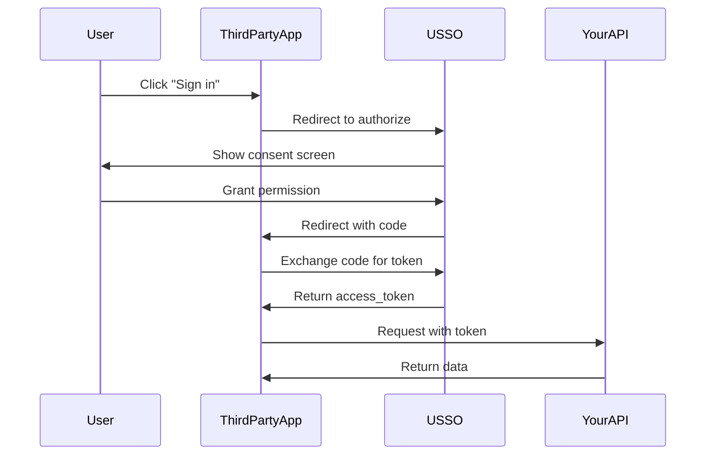

# OAuth Provider Overview

USSO can act as an **OAuth 2.0 and OpenID Connect (OIDC) provider**, allowing third-party applications to authenticate your users. This means you can build an ecosystem where external apps can request access to your users' data with their permission.

---

## What is an OAuth Provider?

Think of how you can "Sign in with Google" or "Sign in with GitHub" on many websites. USSO lets you offer **"Sign in with Your App"** to third-party developers.

### Use Cases

- **Partner integrations** - Let partners access your API on behalf of users
- **Mobile apps** - Provide secure authentication for mobile clients
- **Third-party marketplace** - Enable an app ecosystem around your platform
- **Internal microservices** - Secure service-to-service communication
- **Developer APIs** - Let developers build on your platform

---

## OAuth 2.0 vs OpenID Connect

| Protocol | Purpose | What You Get |
|----------|---------|--------------|
| **OAuth 2.0** | Authorization | Access tokens to access resources |
| **OpenID Connect** | Authentication | ID tokens with user identity info |

USSO supports **both**:
- OAuth 2.0 for accessing APIs
- OIDC for getting user identity information

---

## How It Works



---

## Supported OAuth Flows

### 1. **Authorization Code Flow** (Recommended)

Best for:
- Web applications
- Mobile apps
- Server-side applications

**Security:** ✅ Most secure (uses secret)

### 2. **Implicit Flow** (Legacy)

Best for:
- Single-page applications (SPAs)
- Public clients

**Security:** ⚠️ Less secure (token in URL)

### 3. **Client Credentials Flow**

Best for:
- Machine-to-machine
- Background services
- API-to-API

**Security:** ✅ Secure (no user involved)

---

## Setting Up OAuth Provider

### Step 1: Enable OAuth for Your Tenant

OAuth is enabled by default. Verify your tenant configuration:

=== "cURL"

    ```bash
    curl -X GET http://localhost:8000/api/sso/v1/tenants/org_mycompany \
      -H "Authorization: Bearer YOUR_ADMIN_TOKEN"
    ```

### Step 2: Register a Client Application

=== "cURL"

    ```bash
    curl -X POST http://localhost:8000/api/sso/v1/oauth/clients \
      -H "Authorization: Bearer YOUR_ADMIN_TOKEN" \
      -H "Content-Type: application/json" \
      -d '{
        "name": "My Mobile App",
        "description": "Official mobile application",
        "redirect_uris": [
          "https://myapp.com/callback",
          "myapp://oauth/callback"
        ],
        "grant_types": ["authorization_code", "refresh_token"],
        "response_types": ["code"],
        "token_endpoint_auth_method": "client_secret_post",
        "scopes": ["openid", "profile", "email"]
      }'
    ```

=== "Python"

    ```python
    import requests

    response = requests.post(
        "http://localhost:8000/api/sso/v1/oauth/clients",
        headers={
            "Authorization": f"Bearer {admin_token}",
            "Content-Type": "application/json"
        },
        json={
            "name": "My Mobile App",
            "description": "Official mobile application",
            "redirect_uris": [
                "https://myapp.com/callback",
                "myapp://oauth/callback"
            ],
            "grant_types": ["authorization_code", "refresh_token"],
            "response_types": ["code"],
            "token_endpoint_auth_method": "client_secret_post",
            "scopes": ["openid", "profile", "email"]
        }
    )

    client = response.json()
    print(f"Client ID: {client['client_id']}")
    print(f"Client Secret: {client['client_secret']}")
    ```

=== "JavaScript"

    ```javascript
    const response = await fetch('http://localhost:8000/api/sso/v1/oauth/clients', {
        method: 'POST',
        headers: {
            'Authorization': `Bearer ${adminToken}`,
            'Content-Type': 'application/json'
        },
        body: JSON.stringify({
            name: 'My Mobile App',
            description: 'Official mobile application',
            redirect_uris: [
                'https://myapp.com/callback',
                'myapp://oauth/callback'
            ],
            grant_types: ['authorization_code', 'refresh_token'],
            response_types: ['code'],
            token_endpoint_auth_method: 'client_secret_post',
            scopes: ['openid', 'profile', 'email']
        })
    });

    const client = await response.json();
    console.log('Client ID:', client.client_id);
    console.log('Client Secret:', client.client_secret);
    ```

**Response:**

```json
{
  "client_id": "client_abc123def456",
  "client_secret": "secret_xyz789abc123",
  "name": "My Mobile App",
  "description": "Official mobile application",
  "redirect_uris": [
    "https://myapp.com/callback",
    "myapp://oauth/callback"
  ],
  "grant_types": ["authorization_code", "refresh_token"],
  "scopes": ["openid", "profile", "email"],
  "created_at": "2025-10-04T10:00:00Z"
}
```

!!! warning "Save Client Secret"
    **The client secret is only shown once!** Save it securely.

---

## Implementing OAuth Flow

### For Third-Party Apps

Here's how a third-party app would integrate:

#### Step 1: Redirect User to Authorization

```javascript
const authUrl = new URL('http://localhost:8000/oauth/authorize');
authUrl.searchParams.append('client_id', 'client_abc123def456');
authUrl.searchParams.append('redirect_uri', 'https://myapp.com/callback');
authUrl.searchParams.append('response_type', 'code');
authUrl.searchParams.append('scope', 'openid profile email');
authUrl.searchParams.append('state', 'random_state_string');

// Redirect user
window.location.href = authUrl.toString();
```

#### Step 2: Handle Callback

```javascript
// On https://myapp.com/callback?code=xyz&state=random_state_string

// Verify state matches
if (params.state !== savedState) {
    throw new Error('State mismatch');
}

// Exchange code for token
const response = await fetch('http://localhost:8000/oauth/token', {
    method: 'POST',
    headers: { 'Content-Type': 'application/x-www-form-urlencoded' },
    body: new URLSearchParams({
        grant_type: 'authorization_code',
        code: params.code,
        redirect_uri: 'https://myapp.com/callback',
        client_id: 'client_abc123def456',
        client_secret: 'secret_xyz789abc123'
    })
});

const tokens = await response.json();
// tokens.access_token
// tokens.id_token (if OIDC)
// tokens.refresh_token
```

#### Step 3: Use Access Token

```javascript
const response = await fetch('http://localhost:8000/api/sso/v1/me', {
    headers: {
        'Authorization': `Bearer ${tokens.access_token}`
    }
});

const user = await response.json();
```

---

## OIDC Discovery

USSO provides an OIDC discovery endpoint:

```bash
curl http://localhost:8000/.well-known/openid-configuration
```

**Response:**

```json
{
  "issuer": "http://localhost:8000",
  "authorization_endpoint": "http://localhost:8000/oauth/authorize",
  "token_endpoint": "http://localhost:8000/oauth/token",
  "userinfo_endpoint": "http://localhost:8000/oauth/userinfo",
  "jwks_uri": "http://localhost:8000/.well-known/jwks.json",
  "response_types_supported": ["code", "token", "id_token"],
  "grant_types_supported": [
    "authorization_code",
    "implicit",
    "client_credentials",
    "refresh_token"
  ],
  "subject_types_supported": ["public"],
  "id_token_signing_alg_values_supported": ["EdDSA", "RS256"],
  "scopes_supported": ["openid", "profile", "email", "offline_access"]
}
```

---

## Available Scopes

| Scope | Description | Data Included |
|-------|-------------|---------------|
| `openid` | Required for OIDC | User ID |
| `profile` | User profile data | Name, picture, username |
| `email` | Email address | Email, email_verified |
| `phone` | Phone number | Phone, phone_verified |
| `offline_access` | Refresh token | Allows token refresh |
| Custom scopes | Your API scopes | Depends on your API |

---

## Managing Clients

### List All Clients

=== "cURL"

    ```bash
    curl -X GET http://localhost:8000/api/sso/v1/oauth/clients \
      -H "Authorization: Bearer YOUR_ADMIN_TOKEN"
    ```

=== "Python"

    ```python
    response = requests.get(
        "http://localhost:8000/api/sso/v1/oauth/clients",
        headers={"Authorization": f"Bearer {admin_token}"}
    )

    clients = response.json()
    for client in clients["items"]:
        print(f"{client['name']}: {client['client_id']}")
    ```

### Update Client

=== "cURL"

    ```bash
    curl -X PATCH http://localhost:8000/api/sso/v1/oauth/clients/client_abc123 \
      -H "Authorization: Bearer YOUR_ADMIN_TOKEN" \
      -H "Content-Type: application/json" \
      -d '{
        "redirect_uris": [
          "https://myapp.com/callback",
          "https://myapp.com/oauth/callback"
        ]
      }'
    ```

### Rotate Client Secret

=== "cURL"

    ```bash
    curl -X POST http://localhost:8000/api/sso/v1/oauth/clients/client_abc123/rotate-secret \
      -H "Authorization: Bearer YOUR_ADMIN_TOKEN"
    ```

### Revoke Client

=== "cURL"

    ```bash
    curl -X DELETE http://localhost:8000/api/sso/v1/oauth/clients/client_abc123 \
      -H "Authorization: Bearer YOUR_ADMIN_TOKEN"
    ```

---

## Token Introspection

Verify and inspect tokens:

=== "cURL"

    ```bash
    curl -X POST http://localhost:8000/oauth/introspect \
      -H "Content-Type: application/x-www-form-urlencoded" \
      -d "token=ACCESS_TOKEN" \
      -d "client_id=client_abc123" \
      -d "client_secret=secret_xyz789"
    ```

**Response:**

```json
{
  "active": true,
  "client_id": "client_abc123def456",
  "username": "user@example.com",
  "scope": "openid profile email",
  "sub": "user:xyz789",
  "aud": "client_abc123def456",
  "iss": "http://localhost:8000",
  "exp": 1234567890,
  "iat": 1234564290
}
```

---

## Real-World Example: Mobile App

Here's a complete example for a mobile app:

### Mobile App (React Native)

```javascript
import * as AuthSession from 'expo-auth-session';

const discovery = {
  authorizationEndpoint: 'http://localhost:8000/oauth/authorize',
  tokenEndpoint: 'http://localhost:8000/oauth/token',
};

export default function LoginScreen() {
  const [request, response, promptAsync] = AuthSession.useAuthRequest(
    {
      clientId: 'client_abc123def456',
      scopes: ['openid', 'profile', 'email'],
      redirectUri: AuthSession.makeRedirectUri({
        scheme: 'myapp'
      }),
    },
    discovery
  );

  React.useEffect(() => {
    if (response?.type === 'success') {
      const { code } = response.params;
      // Exchange code for token
      exchangeCodeForToken(code);
    }
  }, [response]);

  async function exchangeCodeForToken(code) {
    const response = await fetch('http://localhost:8000/oauth/token', {
      method: 'POST',
      headers: { 'Content-Type': 'application/x-www-form-urlencoded' },
      body: new URLSearchParams({
        grant_type: 'authorization_code',
        code,
        redirect_uri: AuthSession.makeRedirectUri({ scheme: 'myapp' }),
        client_id: 'client_abc123def456',
        client_secret: 'secret_xyz789abc123'
      })
    });

    const tokens = await response.json();
    // Save tokens securely
    await SecureStore.setItemAsync('access_token', tokens.access_token);
  }

  return (
    <Button
      disabled={!request}
      title="Login with USSO"
      onPress={() => promptAsync()}
    />
  );
}
```

---

## Security Best Practices

### 1. Use HTTPS in Production

Always use HTTPS for redirect URIs in production:

```json
{
  "redirect_uris": [
    "https://myapp.com/callback"  // ✅ Good
    // "http://myapp.com/callback"  // ❌ Bad
  ]
}
```

### 2. Validate Redirect URIs

Only allow pre-registered redirect URIs. USSO validates this automatically.

### 3. Use State Parameter

Always use `state` parameter to prevent CSRF:

```javascript
const state = crypto.randomBytes(32).toString('hex');
// Save state in session
// Verify state in callback
```

### 4. Use PKCE for Public Clients

For mobile and SPA apps, use PKCE (Proof Key for Code Exchange):

```javascript
const codeVerifier = base64UrlEncode(crypto.randomBytes(32));
const codeChallenge = base64UrlEncode(
  crypto.createHash('sha256').update(codeVerifier).digest()
);

// In authorize request
params.append('code_challenge', codeChallenge);
params.append('code_challenge_method', 'S256');

// In token request
params.append('code_verifier', codeVerifier);
```

### 5. Rotate Client Secrets

Regularly rotate client secrets for security.

### 6. Limit Scopes

Only grant minimum required scopes:

```json
{
  "scopes": ["openid", "profile"]  // ✅ Minimal
  // "scopes": ["openid", "profile", "email", "admin:*"]  // ❌ Too much
}
```

---

## Debugging OAuth Issues

### Enable Debug Logging

Set `DEBUG=1` in your `.env` file to see detailed OAuth logs.

### Common Issues

#### "Invalid redirect_uri"

- Ensure redirect URI exactly matches registered URI
- Check for trailing slashes
- Verify protocol (http vs https)

#### "Invalid client_id"

- Verify client exists:
```bash
curl -X GET http://localhost:8000/api/sso/v1/oauth/clients \
  -H "Authorization: Bearer YOUR_ADMIN_TOKEN"
```

#### "Invalid grant"

- Code may have expired (expires in 10 minutes)
- Code can only be used once
- Verify redirect_uri matches authorization request

---

## Next Steps

- **[Setting Up](setup.md)** - Detailed setup guide
- **[Client Registration](clients.md)** - Complete client configuration
- **[Authorization Flow](flows.md)** - Detailed flow documentation
- **[Token Introspection](introspection.md)** - Working with tokens

---

[← Back to Service Accounts](../service-accounts/overview.md){ .md-button }
[Next: Setting Up →](setup.md){ .md-button .md-button--primary }

